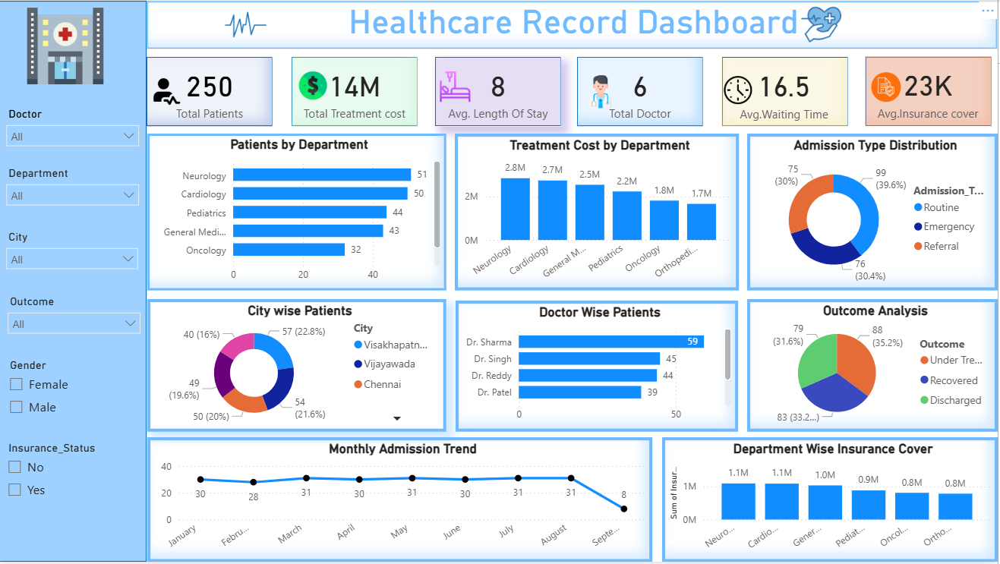

# Healthcare Record Dashboard

## Project Overview
This interactive Healthcare Dashboard was developed using Power BI to analyze patient records, treatment costs, admissions, doctor performance, and insurance coverage.

## Dashboard Features

- Total Patients Analysis
- Total Treatment Cost
- Average Length of Stay
- Doctor-wise Patient Analysis
- Department-wise Patient Count
- Department-wise Treatment Cost
- Admission Type Distribution
- City-wise Patient Distribution
- Outcome Analysis
- Monthly Admission Trend
- Insurance Coverage Analysis

## Tools Used

- Power BI
- Excel
- DAX
- Data Visualization

## Dashboard Preview

## Key Insights

- Neurology handled the highest number of patients.
- Treatment costs are highest in Neurology and Cardiology departments.
- Routine admissions account for the largest share.
- Dr. Sharma treated the highest number of patients.
- Insurance coverage varies significantly across departments.

## Author

Lokesh M K
Aspiring Data Analyst
